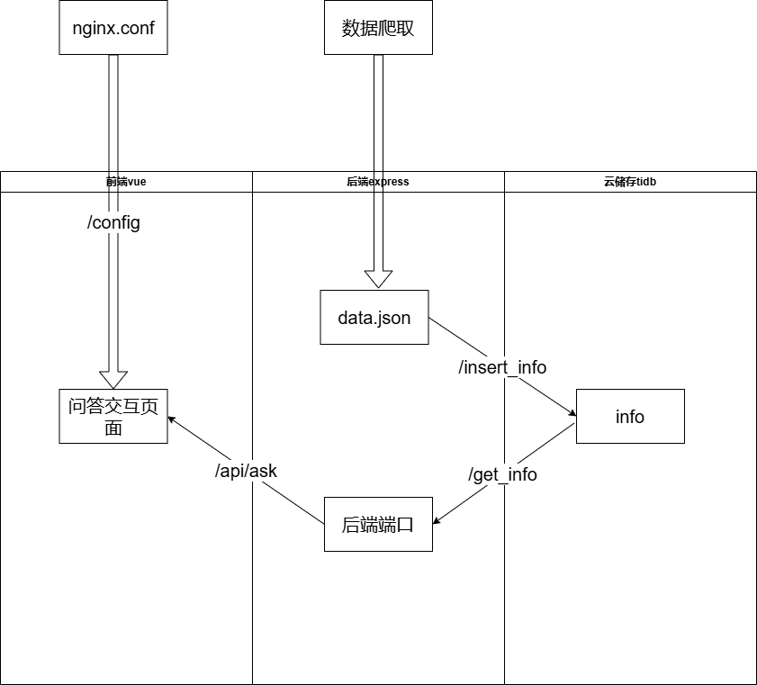
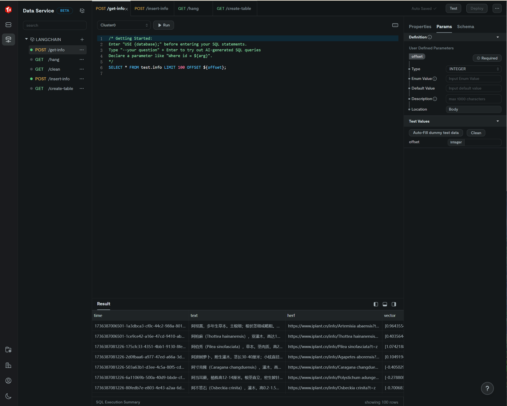

# LANGCHAIN-PUBLIC
## 项目简介

### **BotAnIst**——基于Langchain的植物知识增强AI问答系统
### 项目背景
随着人工智能技术的快速发展，教育领域对智能化知识获取和问答系统的需求日益增长。然而，现有的教育类 AI 问答系统大多集中在通用知识领域，缺乏针对特定领域（植物学）的深度知识增强和个性化问答能力。本项目旨在通过结合 Langchain 框架和云服务，构建一个专注于植物学知识的增强型 AI 问答系统，帮助用户快速获取精准的植物学信息，提升学习和研究效率，推动教育、科研和生态保护领域的发展。

### 产品特点
**领域专注性：**    
与市场上通用的教育类AI问答系统不同，本项目专注于植物学领域，通过导入高质量的植物类文本数据（植物特征、分类、生态习性等），构建一个垂直领域的知识库。这种领域专注性使得系统能够提供更加精准和专业的问答服务。

**知识增强与动态更新：**    
系统采用 Langchain 框架，结合大语言模型（LLM）的能力，能够对导入的植物学文本进行深度理解和知识增强。通过云服务的支持，系统预计可以定期从权威植物学网站（如 iPlant）获取最新的植物学数据，确保知识库的动态更新和实时性。

**基于 Docker 的模块化部署：**    
项目采用 Docker 容器化技术，将整个系统打包成多个独立的 Docker 镜像，并通过Docker Compose实现一键部署。这种模块化设计不仅提高了系统的可维护性和可扩展性，还降低了部署和运维的复杂性。

**云服务集成：**   
系统利用云服务进行数据存储和计算资源的动态扩展，确保在高并发场景下仍能提供稳定的服务。同时，云服务的弹性伸缩能力使得系统能够根据用户需求灵活调整资源，降低运营成本。

**规模化潜力：**    
随着植物学知识的不断积累和系统的优化，本项目可以扩展到其他生物学领域（如动物学、微生物学等），形成一个覆盖广泛生物学知识的 AI 问答平台，具有极大的规模化潜力。

### 社会价值
**教育领域：**    
本项目为植物学学习者、研究者和爱好者提供了一个高效的知识获取工具，能够显著提升学习和研究效率。通过 AI 问答系统，用户可以快速获取植物学知识，减少信息检索的时间成本。

**科研支持：**    
对于植物学研究者，系统提供的精准问答和动态更新的知识库能够辅助科研工作，帮助研究者快速获取最新的植物分类、生态习性等信息，推动植物学领域的科研进展。

**生态保护与科普推广：**     
通过普及植物学知识，本项目有助于提高公众对植物多样性和生态保护的认知，推动生态文明建设。同时，系统可以作为科普教育的工具，帮助学校和科普机构开展植物学知识的普及工作。


## 系统架构

## 技术实现
### 云服务
[https://tidbcloud.com/console](https://tidbcloud.com/console)

### Langchain
```javascript
const { ChatCohere } = require('@langchain/cohere');
const { HumanMessage } = require('@langchain/core/messages');
// 创建 Cohere 模型实例
const model = new ChatCohere({
  apiKey: process.env.VITE_COHERE_API_KEY,  // 使用环境变量中的 API Key
});
// 调用 Cohere API 获取响应
const prompt = `相关背景信息：\n${retrievedContext}\n\n用户问题：\n${question}`;
const response = await model.invoke([new HumanMessage(prompt)]);
```

## 功能演示

## 团队分工
 - 唐健峰：前后端，云服务
## 执行
启动
```sh
docker-compose up -d
```
稍等几秒后
点击
[http://localhost:8888](http://localhost:8888)

停止
```sh
docker-compose down
```